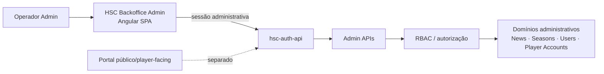

# Domínio — HSC Backoffice Admin

## Responsabilidade

O `hsc-backoffice-admin` é a superfície administrativa do ecossistema HSC. Ele oferece interfaces internas para operadores autorizados executarem tarefas de gestão sem expor essas capacidades ao Portal público/player-facing.

As responsabilidades funcionais incluem:

- gestão de notícias e conteúdo administrativo;
- gestão de Seasons;
- gestão de usuários administrativos;
- consulta e operação sobre contas e perfis de jogadores dentro do escopo de suporte/admin;
- operações administrativas associadas a memberships e acesso, quando autorizadas pelo backend;
- visualização de estados operacionais necessários ao trabalho interno.

O Backoffice não define autoridade de autenticação, sessão ou RBAC. Essas regras pertencem à `hsc-auth-api`; a SPA apenas aplica e representa os contratos e permissões disponibilizados pelo backend.

## Fluxo no ecossistema

A separação entre Backoffice e Portal é intencional: ambos podem consumir capacidades da `hsc-auth-api`, mas atendem atores, permissões e experiências diferentes.

## Glossário

**RBAC**  
Role-Based Access Control. Modelo de autorização em que permissões administrativas dependem do papel e das regras avaliadas pelo backend.

**Admin Users**  
Usuários administrativos autorizados a acessar o Backoffice. Não devem ser confundidos com contas de jogadores.

**Auth Session Cookie**  
Cookie de sessão usado pelo fluxo de autenticação administrativa. Seu conteúdo e suas regras são responsabilidade da Auth API e não devem ser documentados manualmente neste repositório.

**Seasons Admin**  
Conjunto de operações administrativas para criar, consultar e manter Seasons e seus metadados operacionais.

**News Admin**  
Conjunto de operações internas de criação, edição e gestão de notícias e conteúdo relacionado.

**Player Accounts**  
Visão administrativa de contas de jogadores para suporte e operações internas autorizadas. Não é a área player-facing do Portal.

**Membership**  
Associação administrativa vinculada a uma conta de jogador e usada por regras de acesso do ecossistema. O significado efetivo dos estados é definido pelo backend.
